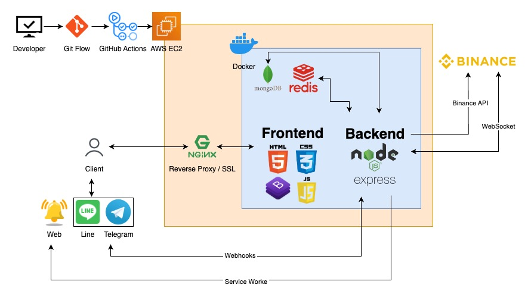

# CryptoSniper[CryptoSniper](https://crypto-sniper.minglin.vip/)

### Crypto Sniper 是一個協助投資人透過均線的篩選，找出標的的一項工具

製作這項工具的原因：因為 Trading View 的篩選功能不夠客製化，也沒有支援多重時框，所以就決定自己做一個，後來 Trading View 改版，免費版本的到價通知以及追蹤清單這兩項功能也有使用上的限制，所以就又額外開發這兩項功能，其實很單純，我會用到什麼功能就去開發，如果有想要新增什麼功能也歡迎跟我討論，謝謝。

1. 透過均線的篩選找出標的，且支援多重時框篩選功能
2. 三種類型的即時報價通知，分別為 Web、Telegram、Line
3. 支援加入追蹤清單、策略儲存的功能

測試用：

- 帳號：test@gmail.com
- 密碼：123456

## API Doc

[API doc](https://crypto-sniper.minglin.vip/api-docs/#/)

## 系統架構

## 資料庫架構

## 聯絡我

林右銘（ Ming ）
ben014335@gmail.com
