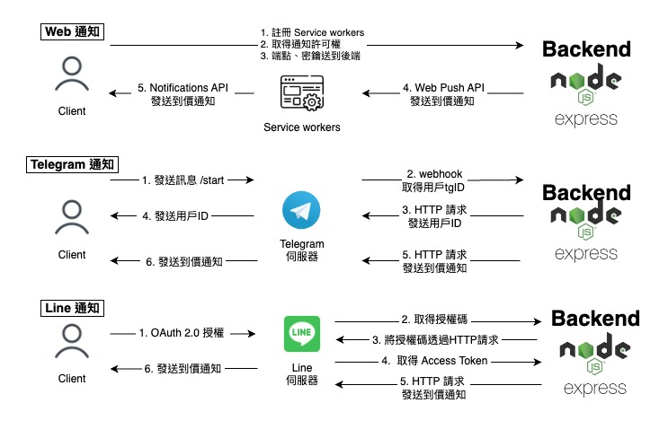

# [CryptoSniper](https://crypto-sniper.minglin.vip/)

### Crypto Sniper 是一個協助投資人透過均線的篩選，找出標的的一項工具

製作這項工具的緣由：因為平常使用的看盤軟體 Trading View ，篩選的功能不夠客製化，也沒有支援多重時框的篩選功能，所以就決定自己做一個，後來 Trading View 改版，免費版本的到價通知以及追蹤清單這兩項功能也有使用上的限制，所以就又額外開發這兩項功能，所以製作這個工具的理由很單純，我會用到什麼功能就去開發，如果有想要新增什麼功能也歡迎跟我討論，謝謝。

1. 使用者可以透過本地登入或是使用 Google 以及 Line 的第三方登入
2. 使用 Redis 加速搜尋效率，每次篩選最多支援四個時間週期，每個時間週期最多支援四條均線（MA）
3. 支援儲存篩選條件、追蹤清單功能，點擊標的名稱可即時顯示 K 線圖表
4. 支援 Web、Telegram、Line，三種到價通知管道
5. 透過 GitHub Action 使用 unit testing 和 Docker 部署，完成 CI/CD

測試用：

- 帳號：test@gmail.com
- 密碼：123456

## API Doc

[API doc](https://crypto-sniper.minglin.vip/api-docs/#/)

## Unit Test Report

[Unit Test Report](https://minglin1995.github.io/CryptoSniper/coverage/lcov-report/)

## 系統架構

## 資料庫架構

### MongoDB

### Redis

## 到價通知架構

## 聯絡我

- 林右銘（ Ming ）
- Email：ben014335@gmail.com
- Linkedin：https://www.linkedin.com/in/youminglin/
