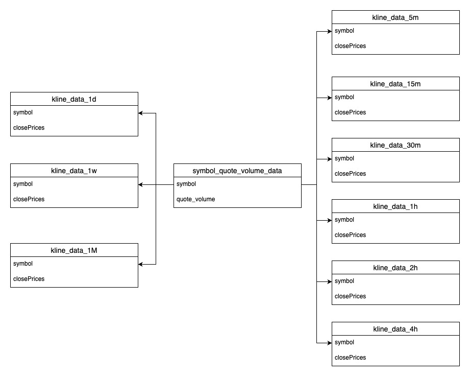

# [CryptoSniper](https://crypto-sniper.minglin.vip/)

### Crypto Sniper 是一個協助加密貨幣投資人透過均線的篩選，找出標的的一項工具

開發這項工具的緣由：因為平常使用的看盤軟體 Trading View ，篩選的功能不夠客製化，也沒有支援多重時框的篩選功能，所以就決定自己做一個，後來 Trading View 改版，免費版本的到價通知以及追蹤清單這兩項功能也有使用上的限制，所以就又額外開發這兩項功能，所以製作這個工具的理由很單純，我會用到什麼功能就去開發，如果有想要新增什麼功能也歡迎跟我討論，謝謝。

1. 使用 **Node.js** 的 **Express** 框架以及 **MongoDB** ，完成後端伺服器的基本架設
2. 使用 **Redis** 加快篩選效率，每次篩選最多支援四個時間週期，每個時間週期最多支援四條均線
3. 透過 **Git** 和 **GitHub Actions** 進行版本控制，並且使用 **Jest** 進行 **Unit Test** ，完成 **CI/CD** ，並且透過 **Docker** 部署到 **AWS EC2** 上
4. 支援 Web 、Telegram 、Line ，三種**到價通知**管道
5. 使用者可以透過本地登入或是使用 Google 以及 Line 的**第三方登入**

測試用：

- 帳號：test@gmail.com
- 密碼：123456

## API Doc

[API doc](https://crypto-sniper.minglin.vip/api-docs/#/)

## Unit Test Report

[Unit Test Report](https://minglin1995.github.io/CryptoSniper/coverage/lcov-report/)

## 系統架構

1. 首先在本地開發的時候是使用 **Git Flow** 的方式去開發 ，並依據不同的功能，新增 feature ，確保各個版本的控制
2. 再透過 **GitHub Actions** 搭配 **Jest** ，完成 **CI/CD** 以及 **Unit Test** ，並自動部署到 **EC2** 上，提升整個開發效率還有正確性
3. 當用戶連線到伺服器時，會透過 **Nginx** 反向代理，自動將連線升級為 **HTTPS** ，確保所有資料傳輸的安全性
4. 主程式是採用前、後端分離的方式去開發，前端使用 **HTML**、**CSS**、**Bootstrap** 、**JavaScript**，後端使用 **Node.js Express** ，並採用 **MVC** 架構去設計
5. 資料庫是使用 **MongoDB** 以及 **Redis**
6. 再利用 **Docker** 將主程式還有資料庫打包起來，主要用意是跟 EC2 內的其他程式做隔離，避免互相干擾，並且因為有輕量級的特性，還可以減少伺服器壓力
7. 外部 API 是使用幣安的 API 將標的資料、成交量、以及最新的 240 根收盤價儲存在 **Redis** 內，並依據不同的 9 個時間週期，定時更新到最新的資料
8. 到價通知的部分是透過 **WebSocket** 的連線，去偵測最新的價格，來確定是否要發送到價通知給用戶
9. 主要的到價通知有三種，分別為 **Web Notification**、**Line**、 **Telegram** ，讓使用者接收到價通知時，有更多的選擇

## 資料庫架構

### MongoDB 儲存會員資料、追蹤清單、策略清單、到價通知設定、到價通知系統

- users（會員系統）
- LineSubscription、TelegramSubscription、WebSubscription（到價通知系統）
- Favorite（追蹤清單）：symbols（標的名稱）
- Strategy（策略清單）：name（策略名稱）、conditions（策略參數內容）
- PriceAlert（到價通知設定）：symbol（標的）、targetPrice（目標價）、notificationMethod（通知方法）

### Redis 依據不同的時間週期，定時更新最新的收盤價資訊，透過快取的機制，提升使用者篩選時的速度

- symbol（標的名稱）、quote_volume（成交量）、closePrices（收盤價）
- 總共有九個時間週期，分別為 5 分鐘、15 分鐘、30 分鐘、1 小時、2 小時、4 小時、1 天、1 週、1 月
- 依據不同時間週期更新最新的 240 個收盤價，例如：5 分鐘時間週期，每 5 分鐘更新一次、1 小時時間週期，每 1 小時更新一次

## 到價通知架構

### Web 到價通知系統

1. 首先進入頁面時，會去偵測使用用者的瀏覽器有沒有支援推送通知的功能，如果有支援，就會註冊 **Service workers** ，這樣就算關閉瀏覽器畫面，放到背景執行，還是可以接收通知
2. 再來會去取得使用者的通知許可權，使用者允許後，就會把端點還有密鑰的資訊送到後端
3. 當價格達到用戶設定的目標價時，後端就會透過 **Push API** 推送到 **Service workers** ，然後再透過 **Web Notifications** 的方式顯示給使用者看

### Telegram 到價通知系統

1. 首先使用者先加入 Telegram 機器人，然後發送啟動的訊息送到 Telegram 伺服器， Telegram 伺服器就會推送使用者的相關資訊到我設定的 **Webhook**
2. 然後後端再透過 HTTP 請求，將收到的用戶 ID 發送到 Telegram 伺服器，Telegram 就會將用戶 ID 回傳給使用者，使用者就可以依據 Telegram ID 去設定到價通知了
3. 然後當價格達到用戶設定的目標價時，後端就會透過 HTTP 請求，將到價通知發送到 Telegram 伺服器， Telegram 伺服器就會將到價通知傳給使用者

### Line 到價通知系統

1. 首先用戶透過 **OAuth 2.0** 授權給 Line 伺服器，Line 會將授權碼傳送到後端
2. 然後後端會將授權碼透過 HTTP 請求發給 Line 伺服器，Line 就會將對應的 Access Token 回傳給後端
3. 取得這個 Token 後，後端就能透過 HTTP 請求，將到價通知發送給 Line 伺服器， Line 再發送通知給使用者

## 聯絡我

- 林右銘（ Ming ）
- Email：ben014335@gmail.com
- Linkedin：https://www.linkedin.com/in/youminglin/
