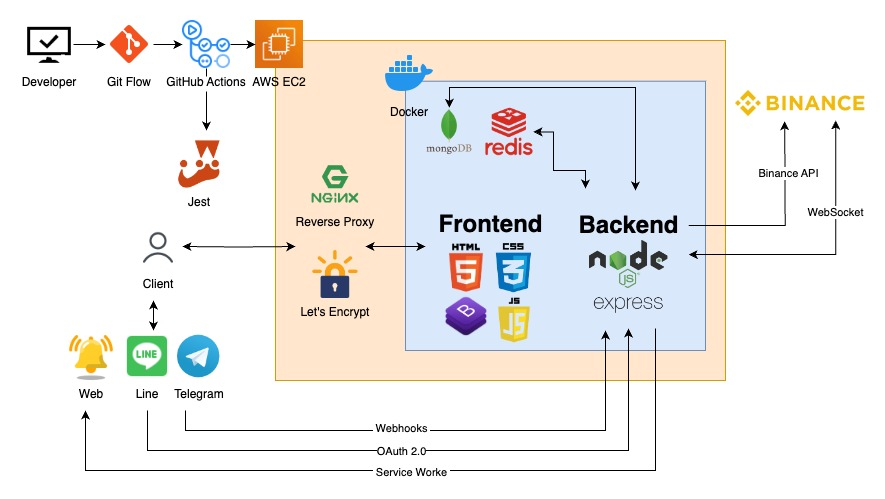
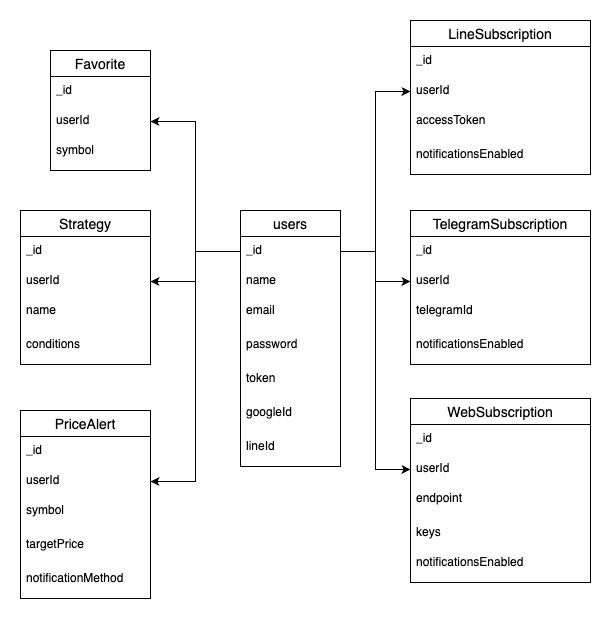
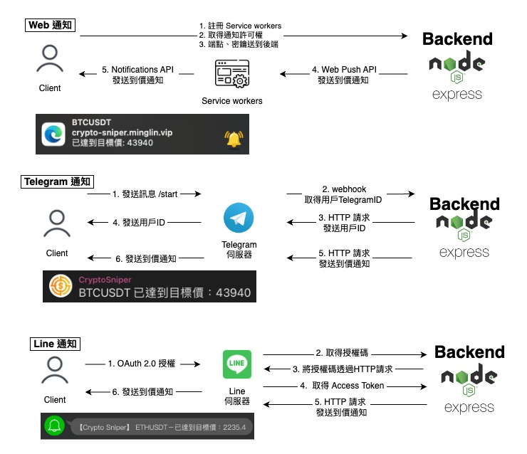

# [CryptoSniper](https://crypto-sniper.minglin.vip/)

### Crypto Sniper 是一個協助投資人透過均線的篩選，找出標的的一項工具

開發這項工具的緣由：因為平常使用的看盤軟體 Trading View ，篩選的功能不夠客製化，也沒有支援多重時框的篩選功能，所以就決定自己做一個，後來 Trading View 改版，免費版本的到價通知以及追蹤清單這兩項功能也有使用上的限制，所以就又額外開發這兩項功能，所以製作這個工具的理由很單純，我會用到什麼功能就去開發，如果有想要新增什麼功能也歡迎跟我討論，謝謝。

1. 使用者可以透過本地登入或是使用 Google 以及 Line 的第三方登入
2. 使用 Redis 加速搜尋效率，每次篩選最多支援四個時間週期，每個時間週期最多支援四條均線（MA）
3. 支援儲存篩選條件、追蹤清單功能，點擊標的名稱可即時顯示 K 線圖表
4. 支援 Web、Telegram、Line，三種到價通知管道
5. 透過 GitHub Action 使用 unit testing 和 Docker 部署，完成 CI/CD

測試用：

- 帳號：test@gmail.com
- 密碼：123456

## API Doc

[API doc](https://crypto-sniper.minglin.vip/api-docs/#/)

## Unit Test Report

[Unit Test Report](https://minglin1995.github.io/CryptoSniper/coverage/lcov-report/)

## 系統架構

## 資料庫架構

### MongoDB 儲存會員資料、追蹤清單、策略清單、到價通知設定、到價通知系統

- users（會員系統）
- LineSubscription、TelegramSubscription、WebSubscription（到價通知系統）
- Favorite（追蹤清單）：symbols（標的名稱）
- Strategy（策略清單）：name（策略名稱）、conditions（策略參數內容）
- PriceAlert（到價通知設定）：symbol（標的）、targetPrice（目標價）、notificationMethod（通知方法）

### Redis 依據不同的時間週期，定時更新最新的收盤價資訊，透過快取的機制，提升使用者篩選時的速度

- symbol（標的名稱）、quote_volume（成交量）、closePrices（收盤價）
- 總共有九個時間週期，分別為 5 分鐘、15 分鐘、30 分鐘、1 小時、2 小時、4 小時、1 天、1 週、1 月
- 依據不同時間週期更新最新的 240 個收盤價，例如：5 分鐘時間週期，每 5 分鐘更新一次、1 小時時間週期，每 1 小時更新一次。

## 到價通知架構

## 聯絡我

- 林右銘（ Ming ）
- Email：ben014335@gmail.com
- Linkedin：https://www.linkedin.com/in/youminglin/
